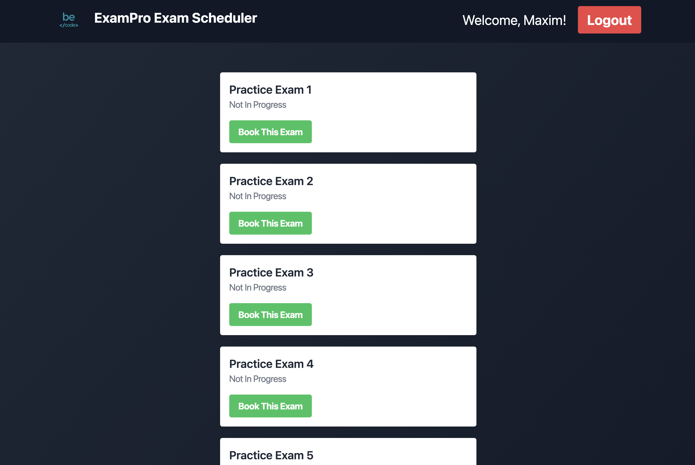
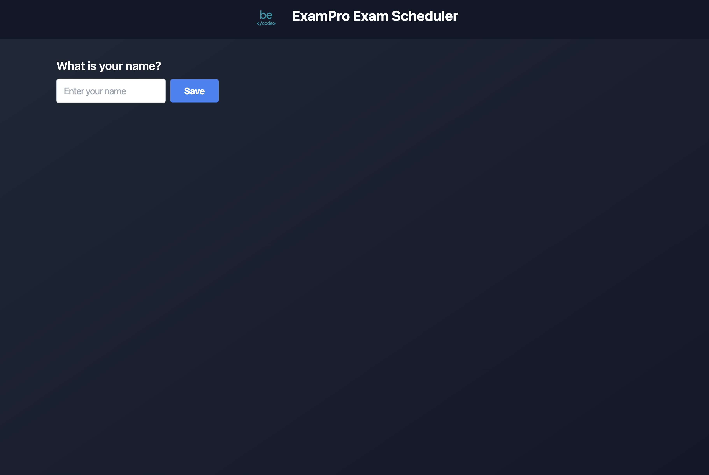

# Mock Exam Scheduler
This is a mock exam scheduler to help learners to schedule their mock exams on Exam pro and make sure to not delete an exam while it is running.

## Deployment
Both the front-end and back-end are deployed on a free tier and are done automatically when a new commit is pushed to the `main` branch in the corresponding folder. 

- The **back-end** is deployed on [Render](https://render.com/) and can be accessed on [exam-scheduler-weld.vercel.app](https://exam-scheduler-weld.vercel.app).
- The **front-end** is deployed on [Vercel](https://vercel.com/) and be accessed on [becode-exam-scheduler-api.onrender.com](https://becode-exam-scheduler-api.onrender.com).
- The **database** is hosted on [MongoDB Atlas](https://www.mongodb.com/cloud/atlas).

## Technologies
- **Front-end:** [React](https://reactjs.org/) with [TailwindCss](https://tailwindcss.com/)
- **Back-end:** [Go](https://golang.org/) with [Fiber]((https://gofiber.io/))
- **Database:** [MongoDB](https://www.mongodb.com/)

## Author
Maxim Berge